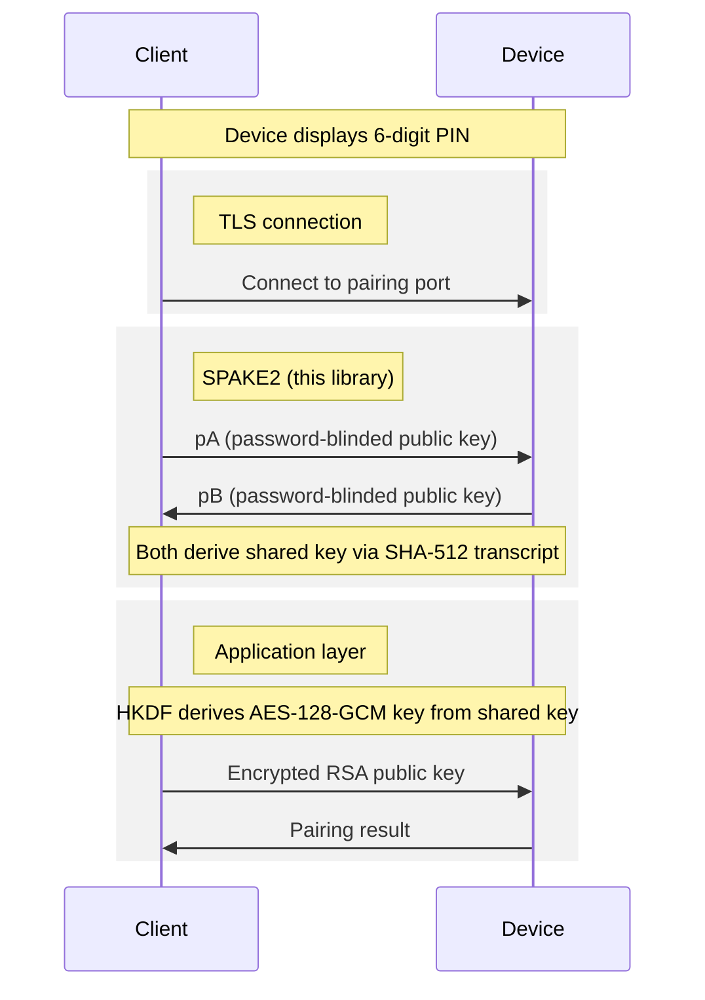

# Spake2

<!-- MDOC -->

SPAKE2 password-authenticated key exchange over Ed25519, compatible with
BoringSSL's implementation. Includes HKDF (RFC 5869) for key derivation.

## Installation

Add `spake2` to your dependencies in `mix.exs`:

```elixir
def deps do
  [
    {:spake2, "~> 0.1.0"}
  ]
end
```

## Usage

### SPAKE2 Key Exchange

Both sides create a context, generate a message, exchange it, and derive the
same shared key when passwords match:

```elixir
password = "123456"

alice = Spake2.new(:alice, "alice", "bob")
bob = Spake2.new(:bob, "bob", "alice")

{alice, alice_msg} = Spake2.generate_msg(alice, password)
{bob, bob_msg} = Spake2.generate_msg(bob, password)

{:ok, alice_key} = Spake2.process_msg(alice, bob_msg)
{:ok, bob_key} = Spake2.process_msg(bob, alice_msg)

alice_key == bob_key  # => true
```

### HKDF Key Derivation

Derive keys from input keying material using HKDF-SHA256 (RFC 5869):

```elixir
# Derive a 16-byte encryption key
key = Spake2.HKDF.derive(shared_secret, 16,
  info: "encryption key",
  salt: salt
)
```

## Protocol



This implements the BoringSSL variant of SPAKE2:

- **Curve:** Ed25519 (twisted Edwards)
- **M/N points:** BoringSSL-specific constants derived from SHA-256 hashing
  `"edwards25519 point generation seed (M)"` and `"(N)"`
- **Password hashing:** SHA-512 reduced mod l with cofactor bit-clearing
- **Transcript:** SHA-512 over length-prefixed (LE uint64) fields
- **Ephemeral key:** 64 random bytes reduced mod l, multiplied by cofactor 8

## Security Notice

**This library has not been independently audited for correctness or security.
Use it at your own risk.** It is not intended for production use in
security-critical applications without a thorough third-party review.

Notable caveats:

- This implements BoringSSL's SPAKE2 variant, **not** RFC 9382. The two are not
  interoperable (different M/N constants, transcript format, and key schedule).
- The underlying field arithmetic uses Erlang/OTP big integers, which are not
  guaranteed to run in constant time. The scalar multiplication algorithm
  (Montgomery ladder) is structurally constant-time, but the BEAM runtime does
  not provide constant-time guarantees for arbitrary-precision arithmetic.
- Password hashing uses SHA-512 (matching BoringSSL), not a memory-hard function
  as recommended by RFC 9382. For low-entropy passwords (e.g. 6-digit PINs),
  the shared secret can be brute-forced offline from a captured transcript.
- Key confirmation (MAC exchange) is not implemented. Callers must verify the
  shared key through their own application-layer mechanism.

## References

- [SPAKE2 RFC 9382](https://www.rfc-editor.org/rfc/rfc9382)
- [HKDF RFC 5869](https://www.rfc-editor.org/rfc/rfc5869)
- [BoringSSL SPAKE2 source](https://boringssl.googlesource.com/boringssl/+/refs/heads/master/crypto/curve25519/spake25519.c)

<!-- MDOC -->

## License

Apache-2.0 — see [LICENSE](LICENSE).
